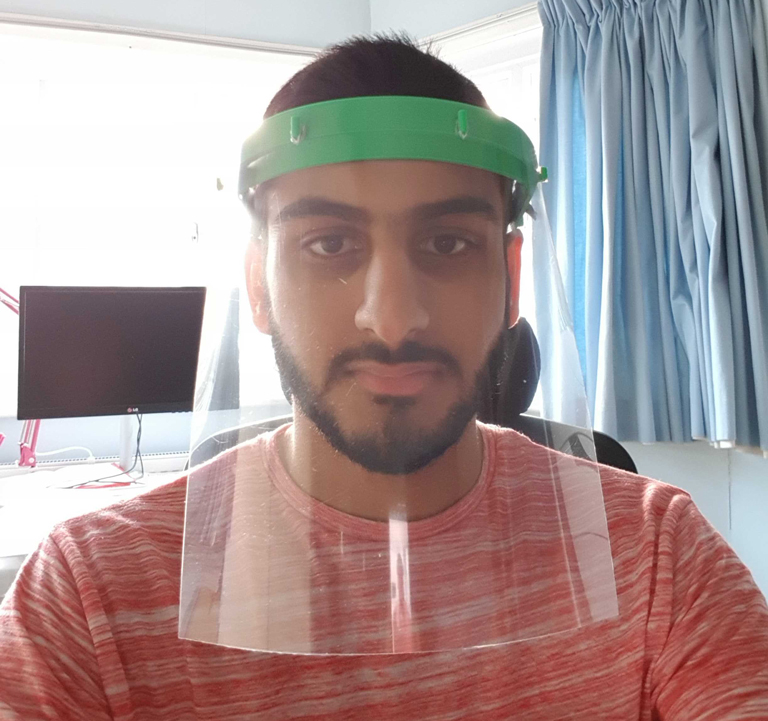
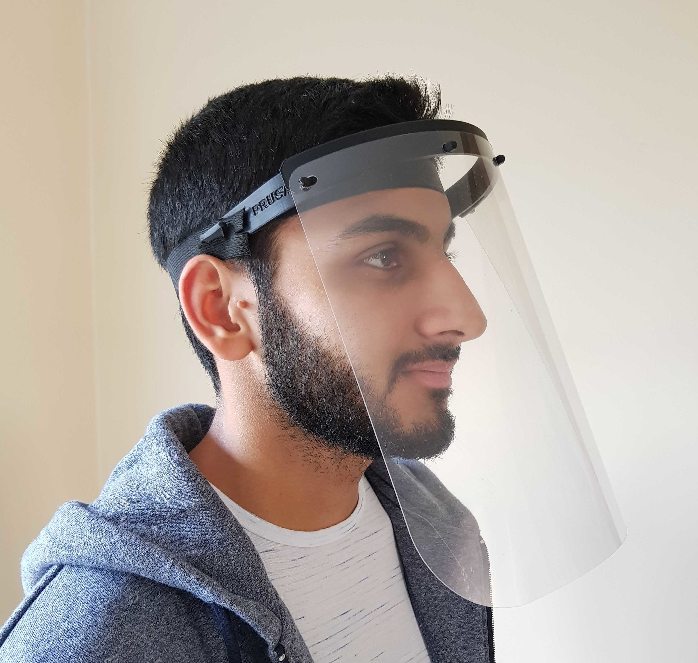
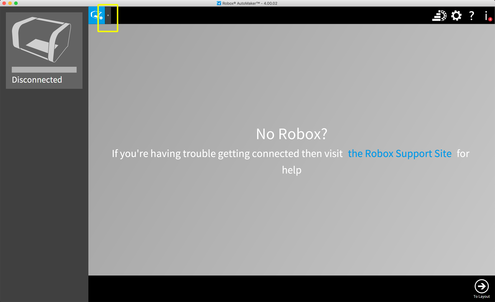
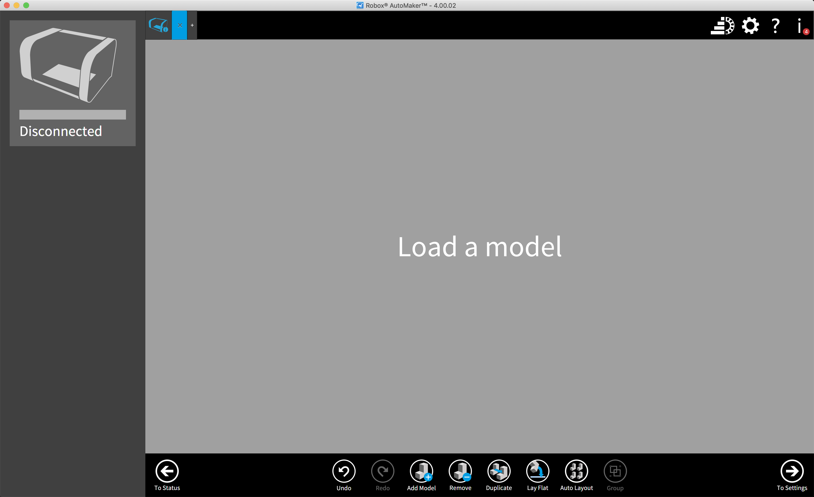

# Visors

NOTE: See [models](models.md) for which files to print. Do not use `visor.stl`.

## What is this document?

This document is a list of materials and instructions for constructing a face visor to help prevent contraction of infectious diseases, as well as contacts for coordinating the distribution of the visors.

Below are images of the finalised piece.

## Note for Medical Professionals

If you are an NHS worker, and you would like to add your details as a point of contact to receive these visors, please see the contact section at the end of this document and reach out to either Dhiresh Nathwana or Sean M. Tracey in any of the channels listed.

## Required tools + materials for constructing the visor.

- A 3D printer with a print space of at least 187mm by 147mm by 21.5mm

- At least 10 metres of either ABS or PLA print filament
    - Other materials may service the print well too, but these are the only materials that have been tested at the time of writing these instructions

## Standard print files to use

To standardise our printing processes and to ensure we’re not all printing different types of the same file.

### Visor 3D printing files

We should ALL printing the Prusa rc3: https://www.prusaprinters.org/prints/25857/files File name: `covid19_headband_rc3.stl`

If you would like to stack the prints please only use these: https://www.prusaprinters.org/prints/27267-prusa-protective-face-shield-rc31-stack-versions/files File name: `covid19_headband_double_rc31.stl` or `covid19_headband_quadro_rc31.stl`
Other files from the Prusa website may be used but please run it by Dhiresh before printing.

### Acetate sheets

If you don’t have any acetate please leave this to Anup, who has a rotary machine cutting all the sheets for us. All parts should be sent to Dhiresh for assembly.

If you do have acetate, the dimensions for the sheet should be 275*250mm. The longer side going across the headband.

### Elastic

The elastic should be 370mm long. Cut a slit in each end of the elastic about 1cm long. Tie one end of the elastic on one side of the visor and leave the other end free for the wearer to tie to the right tightness for their head.

## How to print

Neil Sewell of Solid Print3D has [written instructions](https://www.solidprint3d.co.uk/a-guide-to-printing-face-shields-battling-covid19-one-3d-print-at-a-time/) for printing the visor with the popular Ultimaker range of 3D printers

For those with the smaller CEL Robox 3D printers (used by Sean M. Tracey, Andy Stanford-Clark and others in the maker community) these instructions will walk you through how to adjust the parameters of the VISOR.stl (included in this repo) file with the CEL AutoMaker software.

### Step 1. Loading the STL

First download the STL file listed above to your computer, then open up the AutoMaker software.

Along the top of the application, there is a toolbar of tabs, to the right of any open tabs, click the + icon (highlighted in yellow) to begin the process of loading your STL file.

This will open a new tab with that says "Load a model" in the center of the view. Find the STL file that you downloaded and drag and drop it into the center of the window.

### Step 2. Configuring the print.

Once your model has been loaded and positioned by the AutoMaker software, we're now able to configure the print density of our print.

Click the "To Settings" button at the bottom right corner (highlighted in orange) of the AutoMaker software to go through to the final configuration steps of our print.

We don't need a fine resolution print for the visor, so we'll use the preset options for the coarsest print. This will take ~2 hours to print one visor.

Select the radio button next (highlighted in green) to select the coarsest print. Do not enable any other options.

### Step 3. The print.

We're now ready to start printing the visor. If you have spray adhesive, apply it to the print bed now, this will help prevent warping as the visors are printed. If you don't have the adhesive, keep an eye on the print to make sure that nothing goes awry during the fabrication process.

Click the "Make" button in the bottom right corner to begin the print. The model will be uploaded to your printer and the print will begin.

Once the print has completed, wash your hands with soap and use gloves if possible before you handle the print. Also wash any tools you use to remove the print from the printer and tidy it up.

Check there are no sharp bits on the headband where they will be uncomfortable, or strings hanging off. Trim with a sharp knife as necessary.

## How to package

Wash your hands. Package the print in a clean, sealable bag. You can put multiple visors in the same bag but package different materials separately (ie put ABS prints in a separate bag from PLA prints). Ideally put the bag in another bag or box as well as this will help prevent contamination during transport.

On the bags, write the material used in the print (eg ABS, PLA), write your email address or name so you can be contacted if necessary, and write the date that the print was packaged. The date is important because it is known that COVID-19 can live for up to three days on surfaces. Dhiresh will not open your visors for three days after you packaged them, and then will not deliver the finished visors for three days after he last touched them.

If you are providing the acetate part as well, do not send the visor assembled (to avoid damage). Instead, package the prepare acetate along with the 3d printed visor.

## Where to send

Send your printed visors to Dhiresh for assembly. He will then send them on to the people who requested them. Contact Dhiresh for his postal address.

## Contact Details

Makers for the NHS
 - Email: makers4thenhs@gmail.com
 - Twitter: https://twitter.com/makers4thenhs
